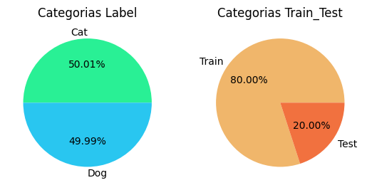
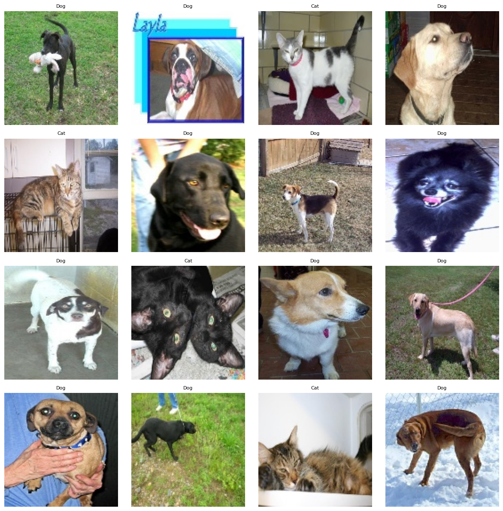
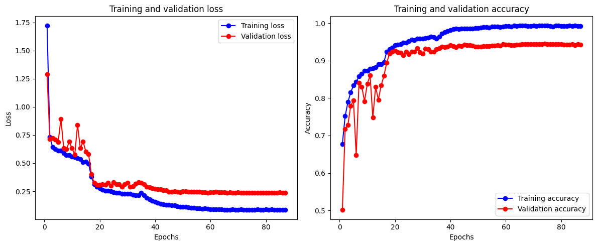
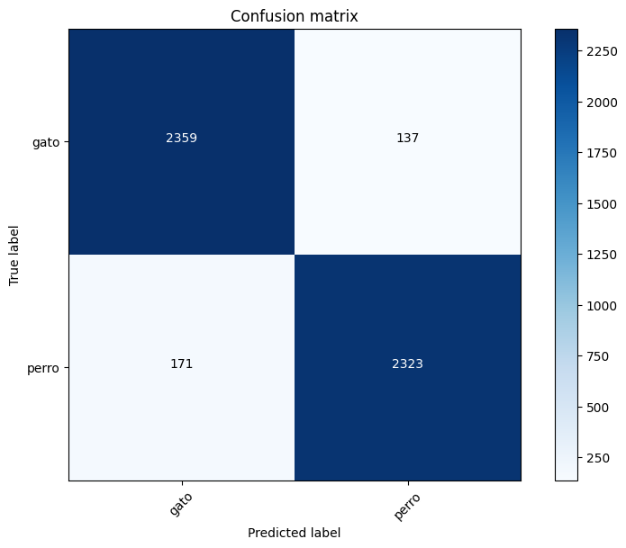

# Clasificación de Imagenes `Dogs`🐶 & `Cats` 🐈

La clasificación de imágenes, especialmente cuando se trata de diferenciar entre perros y gatos, es un tema clásico y fascinante en visión por computadora. Esto abarca desde tareas sencillas, como entrenar un modelo básico con redes neuronales, hasta desafíos más avanzados relacionados con imágenes de baja calidad, variabilidad en las poses, razas, iluminación, etc.

### Definición del Problema

Objetivo: Diseñar un modelo de vision por computadora capaz de clasificar con exactitud imágenes de “perros” y “gatos”.
    
Salida esperada: Etiquetas binarias (0 para gatos, 1 para perros) o categóricas ('gato', 'perro').
    

### Descripcion del Dataset

El Dataset se selecciono de la plataforma kaggle ['Dog and Cat'](https://www.kaggle.com/datasets/bhavikjikadara/dog-and-cat-classification-dataset)

El conjunto de datos contiene `24.998`imágenes, divididas en `12.499` imágenes de `gatos` y `12.499` imágenes de `perros`. Las imágenes de entrenamiento se dividen por igual, entre imágenes de gatos y perros.

## Modelado 
### Redes neuronales de Convolución (CNN)

Acontinuancion se presentan algunas de las imagenes que se proporcionaron como entrenamiento del modelo. Las imágenes utilizadas para entrenar los modelos presentaban una amplia gama de características, incluyendo variaciones en color, tamaño y pose de los animales. Por ejemplo, algunas imágenes mostraban a los animales en entornos con iluminación deficiente, mientras que otras capturaban solo una parte de su cuerpo. Esta diversidad en los datos representa un desafío significativo para las CNNs, ya que requiere que los modelos aprendan a extraer características relevantes a partir de imágenes con apariencia muy diferente.

Para superar este desafío, se utilizaron CNNs con múltiples capas convolucionales. Estas capas permiten a la red aprender a detectar patrones locales en las imágenes, como bordes, texturas y formas, que son fundamentales para distinguir entre gatos y perros. A medida que las características se extraen de capas más profundas, la red es capaz de capturar información más abstracta y relevante para la tarea de clasificación.

## Resultados
### Curvas de Entrenamiento

### Matriz de Confución

### Reporte de Clasificación
|              | Precision | Recall | f1-score | Support |
|--------------|------------|--------|----------|---------|
| Gato         | 0.93       | 0.95   | 0.94     | 2496    |
| Perro        | 0.94       | 0.93   | 0.94     | 2494    |
|              |            |        |          |         |
| accuracy     |            |        | 0.94     | 4990    |
| macro avg    | 0.94       | 0.94   | 0.94     | 4990    |
| weighted avg | 0.94       | 0.94   | 0.94     | 4990    |

## Conclusiones
se seleccionó un modelo convolucional personalizado (modelo #4) como el más adecuado para la tarea de clasificación de imágenes de gatos y perros. Este modelo alcanzó una precisión del 94% en los datos de prueba, con una precisión del 93% para la clase 'gato' y del 94% para la clase 'perro'. La puntuación F1, que proporciona una medida balanceada de precisión y recall, también fue de 94% para ambas clases.

Como siguiente paso, se propone explorar la técnica de transferencia de aprendizaje utilizando la arquitectura ResNetV2.